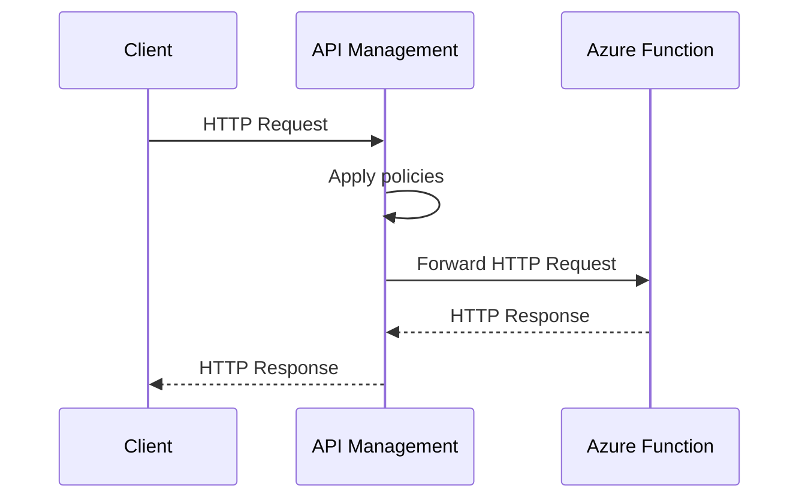

# Connecting Azure API Management to an Azure Function Backend

## Sequence Diagram: Calling APIM with an Azure Function Backend

Below is a sequence diagram illustrating the flow when a client calls an API exposed by APIM, which forwards the request to an Azure Function backend:

