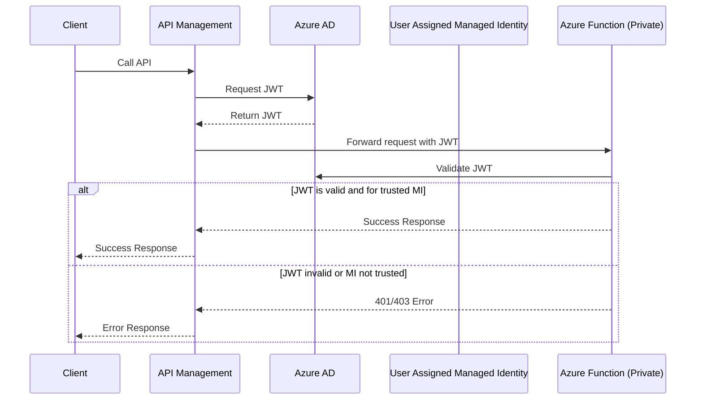

# Connecting Azure API Management to an Azure Function Backend

## Sequence Diagram: Managed Identity JWT Flow

Below is a sequence diagram representing the architecture flow from the provided image, showing how APIM, Azure AD, App Registration, Managed Identities, and the Function App interact:

### Key concepts

- [APIM authentication-managed-identity-policy](https://learn.microsoft.com/en-us/azure/api-management/authentication-managed-identity-policy): APIM uses this to get a JWT
- [Microsoft Graph appRoleAssignments API](http://learn.microsoft.com/en-us/graph/api/serviceprincipal-post-approleassignments): Creates the trust relationship between APIM's managed identity and the Function App by assigning specific app roles. This allows APIM to obtain JWT tokens that the Function App will accept, enabling secure service-to-service authentication without storing credentials. **Note**: App role assignments cannot be automated using Bicep templates (only Azure RBAC role assignments are supported in Bicep).
