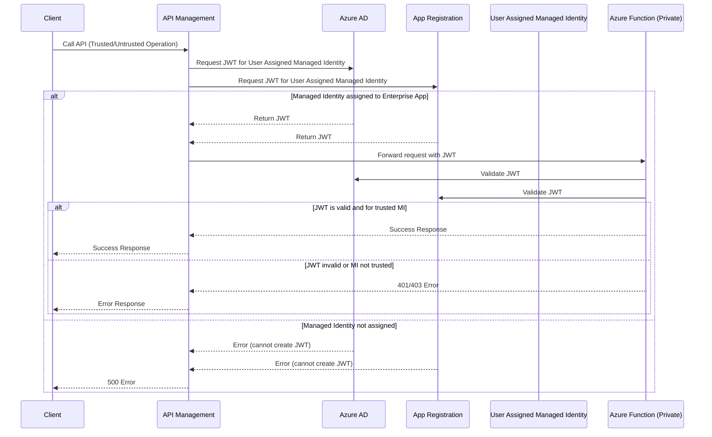
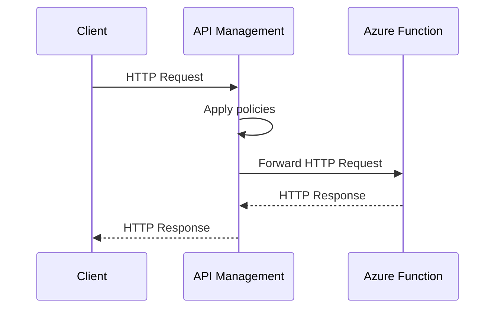

# Connecting Azure API Management to an Azure Function Backend

## Sequence Diagram: Managed Identity JWT Flow

Below is a sequence diagram representing the architecture flow from the provided image, showing how APIM, Azure AD, App Registration, Managed Identities, and the Function App interact:

---

## Previous Sequence Diagram (Simple Flow)

