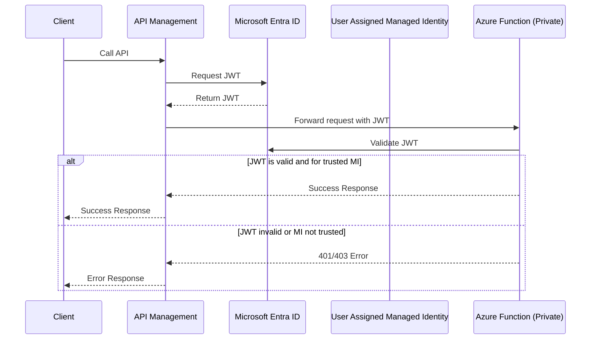
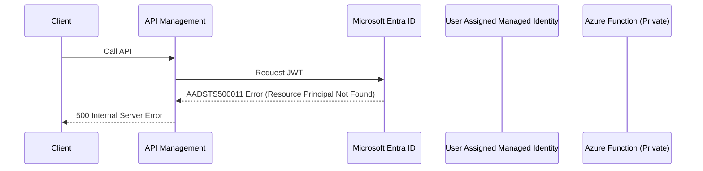

# Connecting Azure API Management to an Azure Function Backend

## Sequence Diagram: Managed Identity JWT Flow

Below is a sequence diagram representing the architecture flow from the provided image, showing how APIM, Microsoft Entra ID, App Registration, Managed Identities, and the Function App interact:

## Key concepts

- [APIM authentication-managed-identity-policy](https://learn.microsoft.com/en-us/azure/api-management/authentication-managed-identity-policy): APIM uses this to get a JWT
- [Microsoft Graph appRoleAssignments API](http://learn.microsoft.com/en-us/graph/api/serviceprincipal-post-approleassignments): Creates the trust relationship between APIM's managed identity and the Function App by assigning specific app roles. This allows APIM to obtain JWT tokens that the Function App will accept, enabling secure service-to-service authentication without storing credentials. **Note**: App role assignments cannot be automated using Bicep templates (only Azure RBAC role assignments are supported in Bicep).

## Troubleshooting

### 500 Internal Server Error

#### AADSTS500011

[AADSTS500011 - Resource Principal Not Found](https://learn.microsoft.com/en-us/troubleshoot/entra/entra-id/app-integration/error-code-aadsts500011-resource-principal-not-found)

APIM says "Hey Entra, can I get a permission to talk to the Function?", and Entra says "Sorry, the Function App's service principal is not registered or discoverable in the directory"

This can happen when the Application ID URI for the App Registration for the Authentication for the Azure Function is not set. The Application ID URI for the App Registration is used as the resource identifier (audience) when requesting JWT tokens. It should be set to a unique URI, typically in the format `api://{client-id}` to identify the Function App as a valid resource that can accept tokens from Entra ID.

## Additional References

### Official Azure Samples

- **[Azure Samples: Functions APIM Managed Identity](https://github.com/Azure-Samples/functions-apim-managed-identity)**  
  Official Microsoft sample demonstrating the same APIM-to-Functions integration pattern using managed identities. Provides alternative implementation approaches and official guidance for this architecture.

### Technical Deep Dives

- **[Assigning API Permissions to Managed Identity using PowerShell](https://praveenkumarsreeram.com/2024/12/29/azure-assign-api-permissions-to-managed-identity-using-powershell/)**  
  Detailed guide on automating app role assignments for managed identities, which complements the shell script approach used in this repository's `assign-apim-mi-to-functionapp-app-role.sh`.

- **[Setting Microsoft Graph Permissions for Managed Identity](https://zenn.dev/ymasaoka/articles/how-to-set-msgraph-permission-managedid)** _(Japanese)_  
  Explains the concepts behind Microsoft Graph permissions and managed identity app role assignments, providing deeper understanding of the trust relationship configuration.

- **[Accessing Easy Auth-enabled Functions with Managed Identity](https://azure.github.io/jpazpaas/2023/10/23/access-to-easyauth-enabled-appservice-or-functions.html)** _(Japanese)_  
  Comprehensive guide on using managed identities to access Easy Auth-enabled App Services and Functions, directly relevant to the Easy Auth configuration automated by this repository's scripts.
